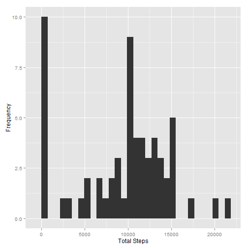
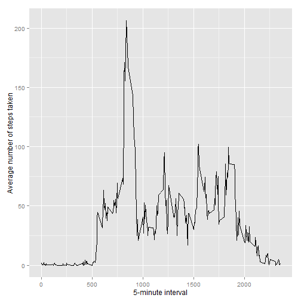
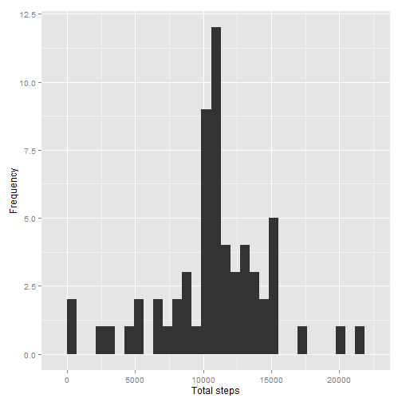
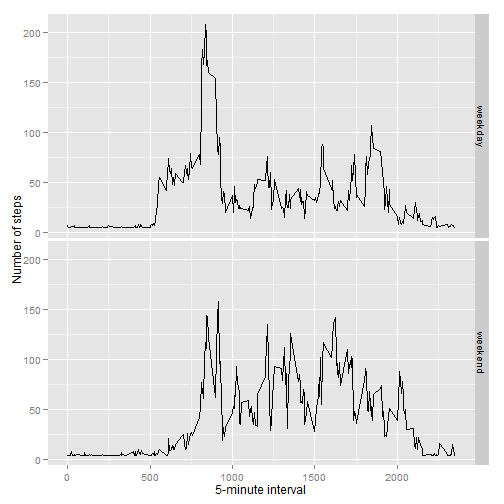

# Reproducible Research: Peer Assessment 1


## Loading and preprocessing the data

Download and read in the data

```r
if(!file.exists('activity.csv')){
      if(!file.exists('activity.zip')){
            fileUrl <- "https://d396qusza40orc.cloudfront.net/repdata%2Fdata%2Factivity.zip"
            download.file(fileUrl, destfile = "activity.zip")
      }
      unzip("activity.zip")
}
activity <- read.csv('activity.csv')
```

## What is mean total number of steps taken per day?

Create a data subset which shows the total number of steps for each day (ignore missing values):

```r
totalSteps <- tapply(activity$steps, activity$date, sum, na.rm=TRUE)
```

Make a histogram of the total number of steps taken each day:

```r
library(ggplot2)
qplot(totalSteps, xlab='Total Steps', ylab='Frequency')
```

```
## stat_bin: binwidth defaulted to range/30. Use 'binwidth = x' to adjust this.
```

 

Calculate and report the mean and median total number of steps taken per day

```r
mean(totalSteps)
```

```
## [1] 9354
```

```r
median(totalSteps)
```

```
## [1] 10395
```

## What is the average daily activity pattern?

Create a data subset which shows mean of steps for each 5 min interval (ignore missing values):

```r
meanSteps <- aggregate(x=list(steps=activity$steps), by=list(interval=activity$interval),FUN=mean, na.rm=TRUE)
```

Make a time series plot (i.e. type = "l") of the 5-minute interval (x-axis) and the average number of steps taken, averaged across all days (y-axis)

```r
library(ggplot2)
ggplot(data=meanSteps, aes(x=interval, y=steps)) + geom_line() + xlab("5-minute interval") + ylab("Average number of steps taken")
```

 

Which 5-minute interval, on average across all the days in the dataset, contains the maximum number of steps?

```r
meanSteps[which.max(meanSteps$steps),]
```

```
##     interval steps
## 104      835 206.2
```

## Inputing missing values

Calculate and report the total number of missing values in the dataset (i.e. the total number of rows with NAs)


```r
missingValue <- is.na(activity$steps)
table(missingValue)
```

```
## missingValue
## FALSE  TRUE 
## 15264  2304
```

Devise a strategy for filling in all of the missing values in the dataset. The strategy does not need to be sophisticated. For example, you could use the mean/median for that day, or the mean for that 5-minute interval, etc.


```r
# Function to replace each missing value with the mean value of 5-minute interval
replace_missing <- function(input_steps, input_interval){
      
      value <- NA
      meanSteps_value <- mean(meanSteps$steps)
      
      if (!is.na(input_steps))
        value <- c(input_steps)
      else
        value <- meanSteps_value
      
      return(value)
}
```

Create a new dataset that is equal to the original dataset but with the missing data filled in.


```r
replacedNA_data <- activity
replacedNA_data$steps <- mapply(replace_missing, replacedNA_data$steps, replacedNA_data$interval)
```

Make a histogram of the total number of steps taken each day

```r
totalSteps2 <- tapply(replacedNA_data$steps, replacedNA_data$date, FUN=sum)
qplot(totalSteps2, xlab='Total steps', ylab='Frequency')
```

```
## stat_bin: binwidth defaulted to range/30. Use 'binwidth = x' to adjust this.
```

 

Calculate and report the mean and median total number of steps taken per day.

```r
mean(totalSteps2)
```

```
## [1] 10766
```

```r
median(totalSteps2)
```

```
## [1] 10766
```

Do these values differ from the estimates from the first part of the assignment?

Yes, the both mean and median have higher values compared to the estimates from the first part of the assignment.

What is the impact of inputing missing data on the estimates of the total daily number of steps?

Replacing the missing data with the mean value increase the total daily number of steps. 

## Are there differences in activity patterns between weekdays and weekends?

Create a new factor variable in the dataset with two levels - "weekday" and "weekend" indicating whether a given date is a weekday or weekend day.

Create a function to classify a date as either weekday or weekend. Run the dataset against the function to insert the new factor variable "day"

```r
IsWeekend <- function(date)
{
      day <- weekdays(date)
      if (day %in% c("Saturday", "Sunday"))
            return ("weekend")
      
      return ("weekday")      
}

replacedNA_data$date <- as.Date(replacedNA_data$date)
replacedNA_data$day <- sapply(replacedNA_data$date, FUN=IsWeekend)
```

Make a panel plot containing a time series plot (i.e. type = "l") of the 5-minute interval (x-axis) and the average number of steps taken, averaged across all weekday days or weekend days (y-axis).

Create a dataset average number of steps taken on weekdays and weekends. 

```r
meanDaySteps <- aggregate(steps ~ interval + day, data=replacedNA_data, mean)
```

Plot the graph.

```r
ggplot(meanDaySteps, aes(interval, steps)) + geom_line() + facet_grid(day ~ .) +
      xlab("5-minute interval") + ylab("Number of steps")
```

 

